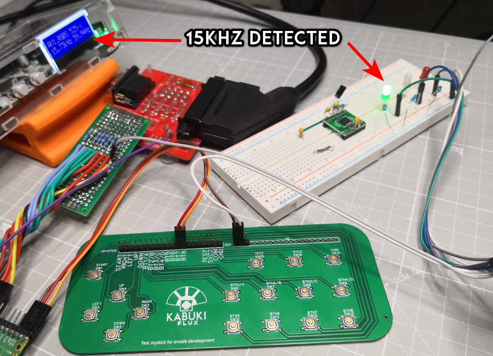
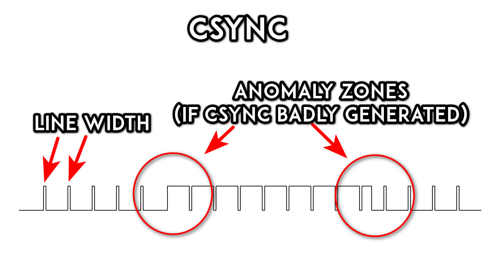
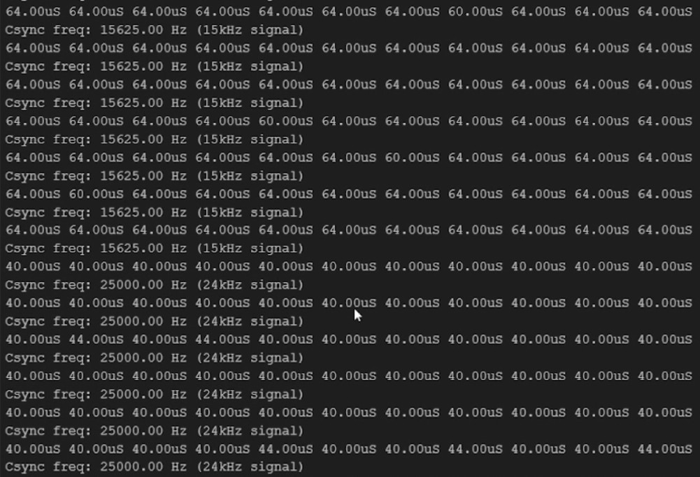

# <h1 align="center">CSync video signal detector  for Arduino Pro Micro</h1>

## Table of contents

- [Why](#why)
- [Description](#description)
- [Installation](#installation)
- [How to use](#how-to-use)
- [Copyright and license](#copyright-and-license)

## Why
Connecting a video signal to a CRT monitor in an arcade
machine can cause problems if the sync is on a range that
the monitor is not prepared to display correctly, if the
chassis is not prepared to display multiple resolutions
or avoid displaying out of range resolutions can cause the
blow of the HOT or worst, so one way to avoid this is
to detect the Horizontal Line Width and disable the video
signal if it's out of sync.

This script was used for testing purposes during a live
event on:
Twitch https://www.twitch.tv/kabukiflux

## Description

This is a simple test script that you can use and adapt
to detect CSync video formats on an Arduino Pro Micro
you're encouraged to improve it as you wish but in no
way this is something to become a production or a final
product, this is made for makers only.

The script detects the line width on a Horizontal Sync
signal or on a CSync signal, on the CSync signal the 
vertical sync is included and it can reach to problems
if we detect the line width on the anomaly zone (the edge
cases with the vertical sync signal). To avoid this issue
we use a sampling of 20 measures and only the most common
measure is taken into account.

The script is able to identify:

- 15khz signals (480i and 240p)

- 24khz signals (384p)

- 31khz signals (480p)

- Out of range signals ( > 480p)

<b>Sample of the serial output:</b>

* as you can see on the output is included the line width 
in uS as well for reference.

## Installation

You need to install the Arduino Ide and the Sparkfun Pro
Micro boards on the Arduino IDE.

## How to use
This script will send debug messages over the USB Serial
Port if enabled at a baudrate of 9600

1- Configure the arduino board and USB port on the IDE.

2- Insert a CSync video signal on the corresponding pin on
the Arduino Pro Micro (see the code).

3- Upload the code to the Arduino.

4- Set the serial port monitor to 9600 baud.

### Copyright and license
See MIT Licensing
